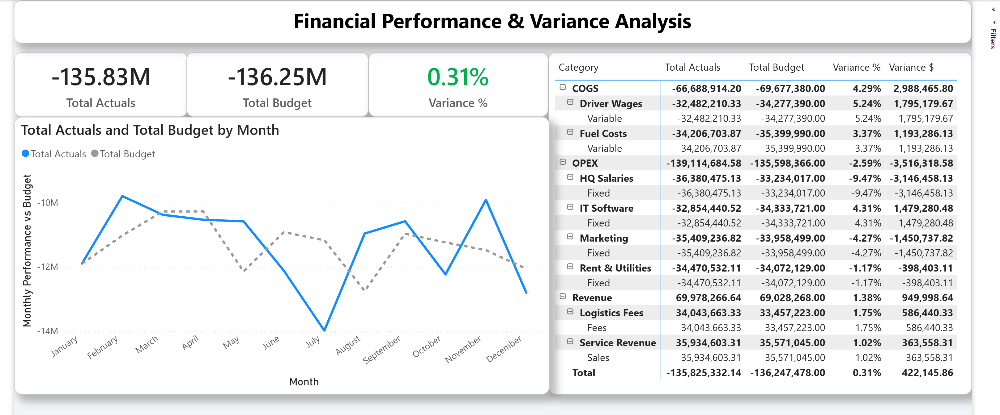

# 📊 Corporate Financial Performance & Variance Dashboard
**End-to-End Finance Operations Portfolio Project**

### 👤 Author
**Mateo Nicolás Alba Botero**
*Industrial Engineer | Finance Process & Data Analyst*
[LinkedIn Profile](https://www.linkedin.com/in/mateoalbabotero/)

---

## 📖 Project Context & Business Case

### 1. The Situation
"GlobalFlow Logistics" (a simulated multinational entity) operates across four major regions: NAM, LATAM, EMEA, and APAC. The Finance department manages a monthly budget of over **$130M USD**, split across Cost of Goods Sold (COGS), Operational Expenses (OPEX), and Revenue streams.

### 2. The Problem
The Finance team was relying on a legacy manual reporting process:
* **Data Silos:** Budget data lived in static Excel sheets, while Actual spending data was extracted from the ERP as raw CSVs.
* **Manual Consolidation:** Analysts spent 3-4 days each month manually merging these datasets, leading to version control issues and formula errors.
* **Lack of Granularity:** The final reports were static PDFs. Management could see *global* overspending but could not drill down to identify *which* specific cost center (e.g., Fuel Costs in LATAM) caused the variance.

### 3. The Justification (My Solution)
To solve this, I acted as a **Finance Architect** to build an automated, scalable data pipeline.
* **Why Python?** To ensure **Data Integrity**. I wrote a script to standardize the raw data schema (enforcing negative values for expenses) *before* it ever touches the dashboard, eliminating human error.
* **Why Power BI?** To provide **Self-Service Intelligence**. By building a Star Schema data model, I enabled executives to drill down from a global view to a transaction level instantly.

---

## 🛠 Technical Implementation

### Phase 1: Data Engineering (Python)
I developed a Python script (`data_generator.py`) to simulate the ETL (Extract, Transform, Load) process.
* **Libraries:** `Pandas`, `NumPy`, `Random`.
* **Logic:** Generated **20,000+ transaction rows** covering a 2-year period.
* **Schema Enforcement:** Automated the accounting logic where *Revenue = Positive integers* and *Expenses = Negative integers*, ensuring the P&L sums correctly without complex manual adjustments later.

### Phase 2: Data Modeling (Power BI)
I rejected the "flat file" approach and designed a robust **Star Schema**:
* **Fact Table:** `Fact_Financials` (20k+ rows of transactions).
* **Dimension Table:** `Dim_ChartOfAccounts` (Maps Account IDs to Categories like COGS/OPEX).
* **Relationship:** 1-to-Many relationship ensures filtering accuracy and high performance.

### Phase 3: Advanced DAX Analytics
I used DAX (Data Analysis Expressions) to create dynamic measures rather than static calculated columns:
* **Variance ($):** `[Total Actuals] - [Total Budget]`
* **Variance (%):** `DIVIDE([Variance $], ABS([Total Budget]), 0)`
* **Dynamic Formatting:** Implemented conditional logic to highlight favorable/unfavorable variances in Green/Red automatically.

---

## 📸 Dashboard Preview

### Executive P&L Overview
*Features a "Card UI" design for high-management visibility, distinguishing "Budget" (Dashed Grey) from "Actuals" (Solid Blue).*

*(Note: Ensure your image file is named 'Dashboard_Screenshot.png' and is in the root folder of this repo)*

---

## 🚀 Key Results & Impact
* **100% Automation:** Reduced the monthly reporting cycle from 4 days to **<5 minutes** (data refresh time).
* **Data Integrity:** Eliminated manual copy-paste errors through the Python ETL layer.
* **Strategic Visibility:** Enabled management to identify a **0.31% positive variance** instantly, with the ability to diagnose specific drivers (e.g., lower Fuel Costs vs. higher HQ Salaries).
